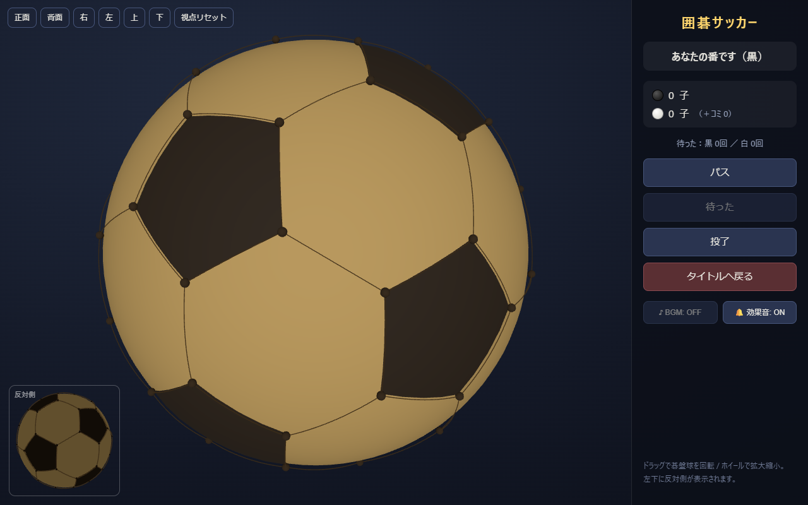

# 囲碁サッカー ⚽

サッカーボール型（切頂二十面体）の格子を碁盤とした、球面で打つ3D碁



## 特徴

- **碁盤球**: 全60点・90辺の切頂二十面体。すべての点が対称で、隅や辺の概念がなく、各点から延びる線は3本
- **純碁ルール**: 両者連続パスで終局し、**盤上の石数**（白はコミ加算）で勝敗判定。捕獲・自滅禁止・同形反復の禁止（superko）は通常の囲碁と同じ
- **NPC対戦**: モンテカルロ木探索（UCT + RAVE + アタリ応答プレイアウト）によるNPC。最大4つのWeb Workerによるルート並列＋探索木の再利用＋相手の思考中の先読み（ポンダリング）。強さ4段階。評価に点差ボーナスを含むため、勝ち確定後も二眼を残して陣地を埋め切る
- **オンライン対戦**: WebSocketによる部屋コード方式の二人対戦。サーバー側でも全手を検証
- **3D操作**: ドラッグで全方向に自由回転（トラックボール式・極でのロックなし）、ホイールでズーム。6方向の視点プリセット＋視点リセット、左下に常時「反対側」ビュー
- **棋譜URL**: 手順をBase64で `?kifu=...` に埋め込んだURLを発行。アクセスすると再生モードで開く
- **振り返り**: 終局後に「対局を振り返る」で1手ずつ再生（⏮◀▶⏭ / ←→キー）
- **待った**: 回数無制限。回数はカウントされ結果画面に表示
- **投了**: 手番に関係なくいつでも可能（確認ダイアログあり）。中押し勝ちとして結果表示され、棋譜URLにも記録される
- **コミ**: 対局前に設定可能（デフォルト 0）
- 置けない点をクリックすると理由を表示（自滅禁止点 / 同形反復の禁止）

## 技術スタック

| 層 | 技術 |
|---|---|
| フロントエンド | Vite + TypeScript + Three.js |
| NPC思考 | MCTS（UCT + RAVE + ヒューリスティックプレイアウト）/ Web Worker ルート並列 |
| サーバー | Node.js + ws（WebSocket）|
| ルールエンジン | TypeScript 共有モジュール（クライアント・Worker・サーバーで同一コード） |

### NPCの強さ検証（アリーナ）

`src/shared/arena.ts` でエンジン設定同士を同一思考時間で対戦させて改善を検証している:

| 比較（150ms/手・40局） | 結果 |
|---|---|
| 素のUCT vs プレイアウト改善 | 改善版が **20勝0敗**（途中打ち切り） |
| プレイアウト改善 vs +RAVE | RAVE版が **26勝14敗**（勝率65% ≈ +108 Elo） |

※ 純碁はプレイアウトが盤を埋め尽くすため、素のRAVEはAMAF統計が飽和して逆効果（0勝8敗）。
プレイアウト序盤12手のみ記録するカットオフを入れることで有効になった。

```sh
npx tsx src/shared/arena.ts 40 150 heur heur+rave  # 設定: base / heur / rave / heur+rave
```

## 起動方法

```sh
npm install

# 開発（Vite: http://localhost:5173、WSサーバー: 8787 に自動プロキシ）
npm run dev

# 本番（ビルドして単一サーバーで配信: http://localhost:8787）
npm run build
npm start
```

## テスト

```sh
npm test          # ルールエンジン・幾何の自己テスト
npm run test:npc  # NPC対ランダムの強さ検証
npm run test:e2e  # オンライン対戦サーバーのE2Eテスト
npm run test:browser  # ブラウザ起動スモークテスト（要: npm run dev 起動中 + Edge）
```

## 構成

```
src/
  shared/    幾何（切頂二十面体）・ルールエンジン・MCTS — 全層で共有
  client/    UI（main.ts）・3D描画（scene3d.ts）・NPC Worker
  server/    WebSocketサーバー + 静的配信
```
